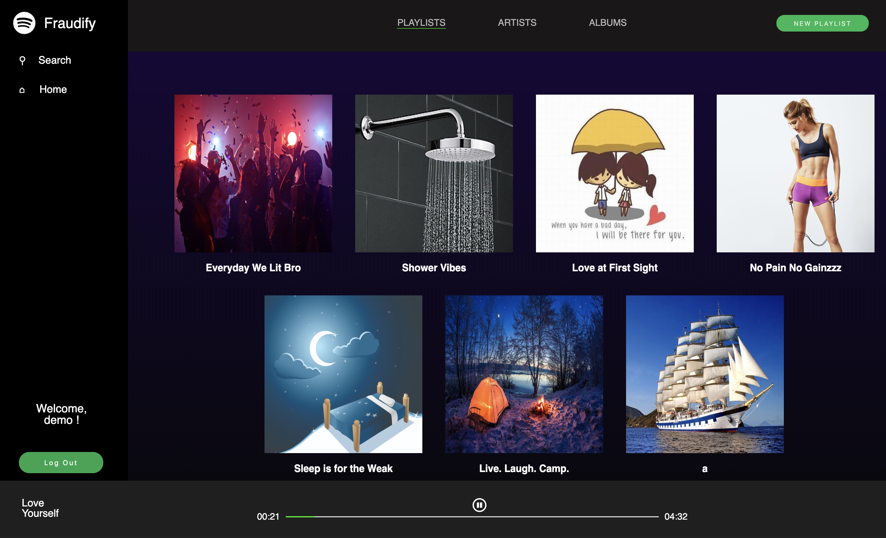
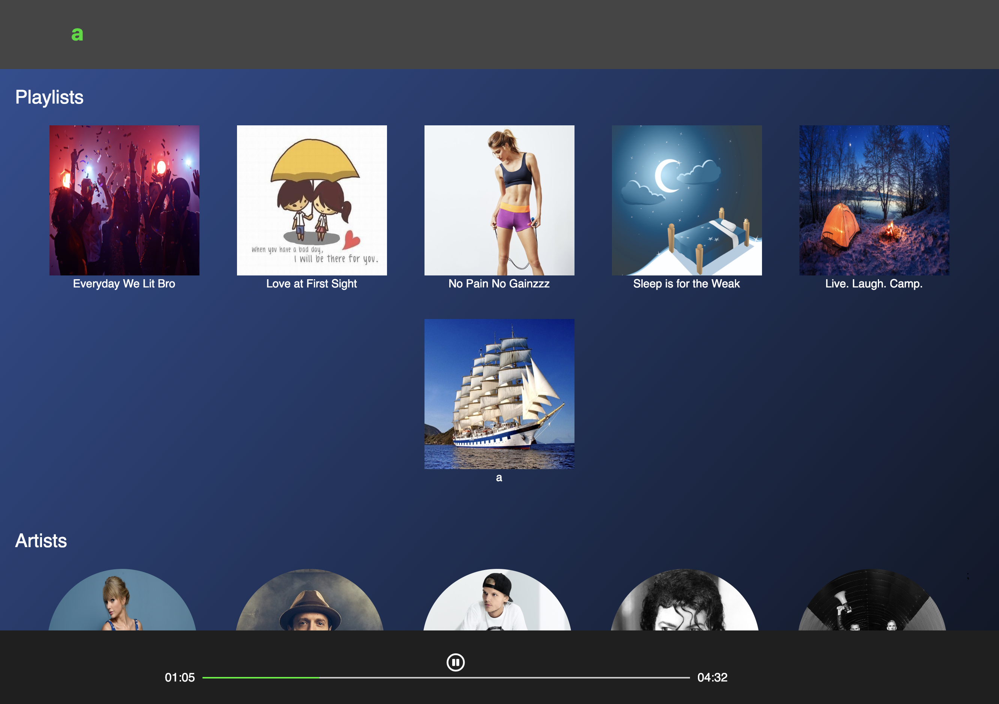

# Fraudify README

[Fraudify](https://fraudify-app.herokuapp.com/) was inspired by Spotify, a music streaming service allowing users to continously listen to songs across pages, search for artists and albums, create playlists, and follow other users.

### Technologies Used
  + Fraudify was created with Rails on the backend using a PostgreSQL database and React/Redux on the frontend.
  + Images and MP3 files were stored on AWS S3, increasing scalability
  + The loading time of the app was optimized through jBuilder and Rails' Active Storage. Fewer interactions with the database helps increase user experience.

  

  
### Key Features
  + Continuous Play
    Continuous Play is very important for streaming. Fraudify allowed users to continously play muisic as they navigated to other pages without interrupting their experience.

  + Progress Bar
    The dynamic progress bar allows users to play and pause songs. To do this, I created a reference to both the progress bar and the audio player using a React element, createRef.
    The user is also able to choose what part of the song they want to move to using the progress bar. I was able to accomplish this by using percentages, thinking of the progress bar as a whole, and calculating the percent change based on the user's click location.
  
  + Playlist CRUD
    Signed in users are also able to create their own playlists. Once created, the playlist shows up on the page with a default picture. Users are also given the ability to delete playlists. All playlists are shown on the Home page of the website!

  + Playlist Songs
    If you have playlists, you must also have songs! Every album has songs and users are given the ability to add songs through the albums show page. 

  + Search
    Users are also able to search for playlists, artists, and albums. I implemented a dynamic search bar that immediately updates the possible playlists, artists, and albums as the user types on the keybaord.

    

  
### Future Plans
  + Queue for songs
  + Liking song favorites
  + Follow other users
